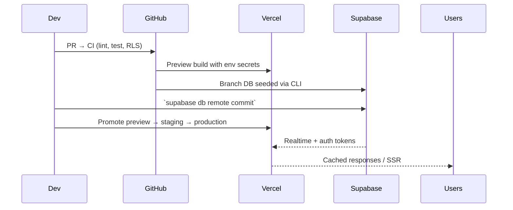

# Architecture Overview

The Ibimina platform is a monorepo housing web, mobile, and Supabase artefacts.
This document summarises the final production architecture.

## High-Level Components

1. **Client Applications**
   - `apps/pwa/staff-admin`: Staff/admin console (Next.js 15 App Router, React
     Server Components) containerized for Node runtime on port 3100.
   - `apps/pwa/client`: Member-facing PWA with offline cache and Workbox service
     worker, built from the same Next.js 15 baseline and packaged for mobile via
     Capacitor.
   - `apps/website`: Marketing site built with Next.js static export.
2. **Backend Services**
   - Supabase Postgres with `app`, `identity`, and `operations` schemas
     protected by RLS. Materialized views surface dashboard aggregates.
   - Supabase Edge Functions (`supabase/functions/*`) handle telecom callbacks,
     reconciliation jobs, and secure exports with HMAC signatures.
3. **Integration Layer**
   - Webhooks from MTN/Airtel process through Edge Functions with signed
     payloads.
   - `packages/providers` exposes clients for mobile money, SMS, and
     notifications.
4. **Observability & Tooling**
   - GitHub Actions pipeline runs lint/tests/RLS proofs.
   - Prometheus + Grafana stack (see `infra/metrics/`) captures metrics; log
     drain exports from Vercel and Supabase feed dashboards.

## Deployment Flow

## Data Flows

- **Authentication**: Clients use Supabase Auth; server components hydrate
  session context via `@supabase/ssr`. RLS ensures tenant isolation for SACCO
  data.
- **Payments**: Telecom callbacks land in `supabase/functions/ingest-sms` and
  `parse-sms`; they write to reconciliation tables and trigger notifications.
- **Reporting**: Materialised views (`app.member_aggregates`,
  `app.payment_rollup`) served through RPC endpoints consumed by admin
  dashboards.
- **Mobile Sync**: Expo app leverages Supabase realtime channels for updates and
  stores offline data with SQLite.

## Operational Concerns

- **Configuration**: Environment matrices maintained in `docs/ENVIRONMENT.md`.
- **RLS Proofs**: SQL tests in `supabase/tests/rls` executed on every merge.
- **Runbooks**: Deployment, incident response, and Supabase operations covered
  in `GO_LIVE_CHECKLIST.md`, `docs/runbooks/SECURITY.md`, and
  `docs/operations-runbook.md`.

This architecture is stable, reproducible across environments, and backed by the
runbooks and verification procedures referenced above.
