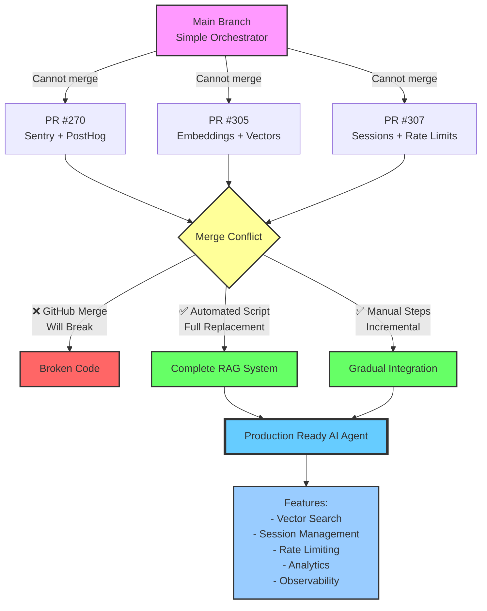
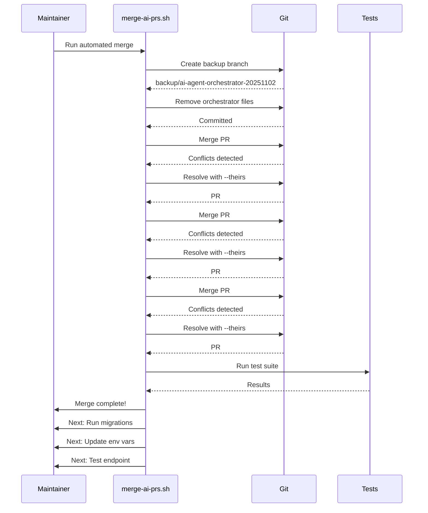

# Architecture Comparison

## Current Main Branch
```
packages/ai-agent/
├── src/
│   ├── orchestrator.ts     ← Orchestration logic
│   ├── agents.ts            ← Agent implementations
│   ├── tools.ts             ← Tool definitions
│   ├── guardrails.ts        ← Safety checks
│   └── session.ts           ← Simple session
└── tests/
    ├── orchestrator.test.ts
    └── guardrails.test.ts
```

**Characteristics:**
- Modular design
- Tool-based approach
- Simple session management
- Basic guardrails

## PR Branches (New Implementation)
```
packages/ai-agent/
├── src/
│   ├── agent.ts                  ← Core AI agent (PR #307)
│   ├── embeddingProvider.ts      ← OpenAI embeddings (PR #305)
│   ├── vectorStore.ts            ← pgvector integration (PR #305)
│   ├── resolver.ts               ← Knowledge base search (PR #305)
│   ├── ingestion.ts              ← Document processing (PR #305)
│   ├── monitoring.ts             ← Metrics (PR #305)
│   ├── rate-limiter.ts           ← Rate limiting (PR #307)
│   ├── usage-logger.ts           ← Analytics (PR #307)
│   ├── opt-out-registry.ts       ← User preferences (PR #307)
│   └── errors.ts                 ← Error types (PR #307)
└── tests/
    └── ai-agent.test.ts

packages/providers/
└── src/
    └── agent/
        └── session-store.ts      ← Redis/Supabase sessions (PR #307)

packages/lib/
└── src/
    └── observability/
        ├── sentry.ts             ← Sentry integration (PR #270)
        ├── pii.ts                ← PII scrubbing (PR #270)
        ├── posthog-edge.ts       ← PostHog client (PR #270)
        └── posthog-server.ts     ← PostHog server (PR #270)
```

**Characteristics:**
- Comprehensive RAG system
- Vector search capabilities
- Durable session storage
- Enterprise-grade rate limiting
- Full observability stack

# Conflict Resolution Flow



# Database Schema Changes

## PR #305: Vector Store
```sql
-- New tables for RAG system
CREATE TABLE ai_documents (
  id UUID PRIMARY KEY,
  org_id UUID REFERENCES organizations,
  title TEXT,
  checksum TEXT,
  token_count INTEGER,
  ...
);

CREATE TABLE ai_document_chunks (
  id UUID PRIMARY KEY,
  document_id UUID REFERENCES ai_documents,
  content TEXT,
  embedding VECTOR(1536),  -- pgvector type
  ...
);

-- Similarity search function
CREATE FUNCTION match_ai_document_chunks(
  query_embedding VECTOR(1536),
  match_count INT,
  ...
) RETURNS TABLE (...);
```

## PR #307: Session Management
```sql
-- New tables for agent runtime
CREATE TABLE agent_sessions (
  id UUID PRIMARY KEY,
  org_id UUID REFERENCES organizations,
  user_id UUID REFERENCES auth.users,
  messages JSONB,
  expires_at TIMESTAMPTZ,
  ...
);

CREATE TABLE agent_usage_events (
  id UUID PRIMARY KEY,
  session_id UUID REFERENCES agent_sessions,
  prompt_tokens INTEGER,
  completion_tokens INTEGER,
  cost_usd NUMERIC,
  ...
);

CREATE TABLE agent_opt_outs (
  id UUID PRIMARY KEY,
  org_id UUID,
  user_id UUID,
  channel TEXT,
  ...
);
```

# Environment Variables

## New Configuration (from PR #307)
```bash
# Session Storage
AI_AGENT_SESSION_STORE=supabase        # or "redis"
AI_AGENT_SESSION_TTL_SECONDS=3600
AI_AGENT_REDIS_URL=redis://...         # if using Redis

# Rate Limiting
AI_AGENT_RATE_LIMIT_MAX_REQUESTS=60
AI_AGENT_RATE_LIMIT_WINDOW_SECONDS=60

# Analytics
AI_AGENT_USAGE_LOG_ENABLED=true
AI_AGENT_USAGE_LOG_TABLE=agent_usage_events
AI_AGENT_OPTOUT_TABLE=agent_opt_outs
```

## Existing (required)
```bash
OPENAI_API_KEY=your-key
SUPABASE_URL=https://...
SUPABASE_SERVICE_ROLE_KEY=...
```
